# Lawyer Recommendation Agent

The existing `/admin/lawyers` panel and `/api/lawyer-recommendations` endpoint now start a persistent, admin-approved recommendation workflow. Gemini understands the legal issue but never sees a tool for writing to the database and never selects a lawyer ID. The backend supplies real catalog and active lawyer snapshots to the internal Python service. Python ranks and validates those records; ASP.NET checks the returned IDs again against PostgreSQL.

```mermaid
flowchart LR
  A[Admin requirement] --> B[Gemini structured classification]
  B --> C[Validate category against database catalog]
  C --> D[Search real active lawyers and unbooked dates]
  D --> E[Deterministic ranking]
  E --> F[Validate IDs, category, status, date]
  F --> G[Persist recommendations and audit; await approval]
  G --> H[Admin selects recommended lawyer and real slot]
  H --> I[Revalidate and call existing AppointmentService]
  I --> J[Persist booking result and audit]
```



The Python LangGraph nodes are `parse_requirement`, `validate_category`, `search_lawyers`, `rank_candidates`, `validate_recommendations`, and `await_human_approval`. The backend persists the pause in `LawyerRecommendationWorkflows` (JSONB snapshots and timestamped audit events); approval resumes by workflow ID. The existing `AgentWorkflows` table belongs to service requests and is not changed. Scores are ranking points based on recorded specialization, matching service, years of experience, and real unbooked date availability; they are not probabilities. The lawyer table has no location or verification field, so location is reported as unsupported and `Active` is the eligibility status. No legal advice is generated.

## Configuration and setup

The default model is `gemini-3.8-flash` in `ai-service/model_config.py`; `GEMINI_MODEL` overrides it. The lawyer agent uses the official `google-genai` SDK with Pydantic structured output. Other AI agents still use their existing LangChain integration.

Create `ai-service/.env` from `.env.example` and set `GEMINI_API_KEY`, `GEMINI_MODEL`, and `AI_INTERNAL_KEY` to private values. The `.env` file is Git-ignored. Set `Ai__BaseUrl=http://127.0.0.1:8002/` and `Ai__InternalKey` to the same internal key in the backend process environment. The API key is used only by Python, never sent to browsers or mobile devices. Missing Gemini configuration and transient Gemini failures return 503. Invalid model categories return 422. Temporary Gemini errors are retried at most twice with short exponential backoff.

Apply the new EF Core migration to a database you are authorized to update before using the new endpoint:

```sh
EfDesignTime=true dotnet ef database update --project backend/LegalService.API/LegalService.API.csproj --startup-project backend/LegalService.API/LegalService.API.csproj
```

Review your target connection string first. This migration adds only `LawyerRecommendationWorkflows`; it does not change other members' entities. Apply it separately to each environment where this feature will run.

Run each process in a separate terminal from the repository root:

```sh
cd ai-service
python3 -m venv .venv
.venv/bin/python -m pip install -r requirements-member1.txt
set -a; source .env; set +a
.venv/bin/python -m uvicorn lawyer_recommendation.app:app --host 127.0.0.1 --port 8002
```

```sh
export Ai__BaseUrl=http://127.0.0.1:8002/
export Ai__InternalKey='YOUR_PRIVATE_INTERNAL_KEY'
dotnet run --project backend/LegalService.API/LegalService.API.csproj --launch-profile http
```

```sh
cd frontend
npm ci
npm run dev
```

```sh
cd mobile
flutter pub get
flutter run
```

Flutter uses the configured backend URL (default `http://localhost:5000`). On Android, use the project's existing `adb reverse tcp:5000 tcp:5000` setup or configure a reachable backend address.

## API and human approval

All recommendation endpoints require the existing Admin JWT. Workflows are readable or approvable only by the Admin who started them. The Python endpoint accepts only requests with the backend's `X-Internal-Key` and is not called by React or Flutter.

```http
POST /api/lawyer-recommendations
Authorization: Bearer <admin JWT>
Content-Type: application/json

{"requirement":"I need help with a synthetic property dispute in Jaffna","date":"2026-10-05","limit":3}
```

The existing `recommendations`, `warnings`, and `trace` fields remain; the response also contains `workflowId`, `status` (`AWAITING_APPROVAL` or `NO_MATCH`), `parsedRequirement`, and `date`. A no-match response has an empty recommendations array and a warning. Use `GET /api/lawyer-recommendations/{workflowId}` to resume or inspect the saved result and audit events.

```http
POST /api/lawyer-recommendations/{workflowId}/approve
Authorization: Bearer <same admin JWT>
Content-Type: application/json

{"lawyerId":"<ID from this workflow>","customerId":"<existing booking customer UUID>","slotId":"<unbooked slot UUID>"}
```

Approval rejects any ID outside the saved recommendation set. It rechecks active status, specialization, slot ownership, requested date, and availability, then calls the existing `AppointmentService.BookAppointmentAsync`. On success the response status is `ACTION_COMPLETED` and includes `appointmentId`. Approval requires a customer UUID and slot UUID because the existing appointment API requires them. The recommendation flow does not create customers or slots itself. **Existing project limitation:** `Appointment.CustomerId` is a UUID while `User.UserId` is an integer; the existing booking service does not validate that the supplied customer UUID maps to a user. This feature preserves that contract and therefore cannot guarantee customer identity until the appointment module resolves the mismatch.

The React admin lawyer page has the recommendation panel and approval controls. The Flutter lawyer page exposes an Admin-only recommendation screen; both call the same backend API. Flutter does not contain AI logic.

## Test and demo

```sh
cd ai-service
.venv/bin/python -m unittest discover -s tests -p 'test_recommendation*.py' -v
cd ..
dotnet test backend/LegalService.Tests/LegalService.Tests.csproj --filter FullyQualifiedName~LawyerRecommendationApprovalTests
cd frontend && npm run build
```

For a synthetic demo, sign in as Admin, open **Lawyer Management → AI Recommendation**, enter “I need a lawyer for a synthetic property ownership dispute in Jaffna” and an optional date with an unbooked slot. Show that Gemini selects only an existing category, that the result uses real lawyer IDs and warns that location is unsupported, and that the workflow waits for approval. Try approving an unrelated lawyer ID to show rejection. Then select a recommended lawyer, an existing customer UUID, and a real slot to create the booking. As a safe-failure demo, disconnect the Gemini service or unset `GEMINI_API_KEY`: the API returns a controlled error and no lawyer or booking is fabricated.
